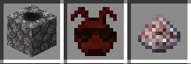
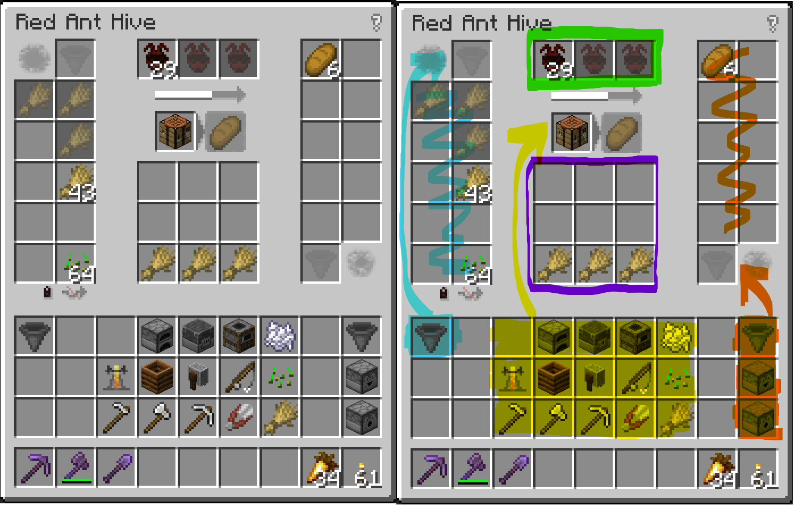

## Anthill Inside

A [Minecraft](https://minecraft.net) (Java Edition) mod adding Red Ants, which provide
natural automation. Additions of blocks, items, and recipes are reduced to a minimum,
the Look & Feel is designed vanilla-like. Features include item transport and sorting,
crafting, cooking/smelting, brewing, composting, farming, fishing, shearing, fertilizing
(bone meal), wood chopping, block braking, block placing, disenchanting, fluid collection.

***Note for coders/modders: Please take a look into the MC version branches to view/clone the source code.***

### Distribution file download

Main distribution channels for this mod:

  - Curse: https://minecraft.curseforge.com/projects/anthillinside/files
  - Modrinth: https://modrinth.com/mod/anthillinside

## Description

The mod adds only a few things to the game:

  - *Red Ant Hive*: Ant breeding and processing block.
  - *Red Ants*: Workers in Hives, or placed as Ant Trail for item transport.
  - *Red Sugar*: Hive colony growth and work accelerator.
  - *Covered Ant Trail*: Hollow wood log for unidirectional item transport.
  - *Queen's Lair*: Starter nest with pygmy ants. Feed it with Red Sugar to make a grown Hive.

## Getting Started

Red Ant Hives can be found when mining Redstone Ore (low chance, but you'll
eventually get one). This is then a new colony with no workers yet, so place
it down and give it some time to produce worker ants. By putting Red Sugar
the left-side GUI slots of the Hive, you speed up this process.

Once a few worker ants are there, you can give the colony a task, or take
some workers out to use them for item transport as Red Ant Trails. At the
beginning you will be short on ants, and processing will be slow, but the
colony steadily grows to its full size (3x64 ant "units").

## Red Ant Trails

Trails are, in short, item conveyors:

- To place Trails, click with Red Ants on the ground or wall (latter for
  transporting items up). The transport direction is by default the direction
  that you are looking.

- Ant Trails transport items by chucking them in the transport direction,
  so that items jump on trails. Long straight paths are accelerated, while
  the speed is reduced when the Trail direction changes.

- Ant Trails insert items into inventories they are facing to.

- Ant Trails allow transported items to be picked up (yes, that is intentional).

- To correct the transport direction, sneak-click an Ant Trail with Red Ants
  (means Ants are their own rotation wrench).

- Ant Trails can bridge one block in case you accidentally break a supporting
  block under a Trail, or like to replace it.

- To make an Ant Trail self-supporting (and also down-inserting), click the
  Trail with a Ladder (or formally a Scaffolding). This will consume the Ladder.
  To remove the support, either break the Trail block or click again with a
  Ladder.

- Ant Trails allow mundane item sorting via Item Frames. If you place an item
  frame into the space of a Trail, items will get diverted away from the item
  displayed in the Frame. This may be used to divert to another Ant Trail, or
  off the cliff. By placing the Item Frame *above* the Trail (facing down),
  then the Trail will insert the shown item into an inventory underneath it.
  *See Credits and References*.

- Ant Trails are water resistent.

- Ant Trails itch mobs, animals, villagers, and players. Mobs also get a bit of
  damage in the process.

- Ant Trails do not need Block Entities (to whom it may concern), and do only
  consume game performance if an item fall on them.

## Covered Red Ant Trails

Simple trails running inside hollow wood logs. They have one main input
side (big hole) and one output side (small hole).

- Covered trails are placed like logs, and by default transport
  items away from the face you clicked. By sneak-clicking, this direction
  is reversed (transport into that direction).

- Covered trails transport faster than Red Ant Trails.

- Covered trails have an inventory of one stack.

- Items can be inserted into Covered Ant Trails from the sides.

- Covered trails insert items into inventories. If there is no inventory
  on the output side of a covered trail, the item is dropped in the world
  if possible, or stuck (filling up the stack in the log).

- To check how full (or clogged) a covered trail is, click on it, and a
  hollow wood sound will be hearable. The the higher the tune, the more
  full is the log.

- Covered trails do *not* allow item pickup.

- Red Ant Trails can be placed on Covered Ant Trails.

## Red Ant Hives

Hives do the actual processing (the grunt work), which can be either recipe
based crafting, or interacting with the world. For the latter, the Hive placement
direction (input and output holes) are important.

### Placement and UI

Placing Hives without sneaking will always place them upright - input at the top,
output at the bottom. For directional placement, sneak-click. The Hive will then
be directed in the direction you are facing.

Clicking the block will open its GUI. The screenshot shows the plain UI, where a
Hive is used for 3x3 crafting. At the right, some ranges explained later on are
marked.

There is no in-game "Manual" for the hive, however, the GUI provides extensive
explanations with tool tips when hovering slots and images, as well as a help
tool tip when hovering the items with the Control+Shift keys down.

- The three green marked slots are your colony's worker ants. New ants are slowly
  but steadily bred there. If no ants are yet in a Hive, it cannot do its work.

- The work instruction for hive is given by placing a corresponding item (marked
  yellow, there are more actually) slot in the center of the UI (where the yellow
  arrow point to). Read on to see what can be processed and how. Right next to
  that is a display for the currently crafted item (not always visible).

- Below the work instruction 3x3 slots (marked purple, not always visible) for
  detailing the work instruction. E.g. for normal crafting, it is the crafting
  grid, for smelting it is used to specify allowed fuels, and so on.

- The orange colored slots mark the output range. Extracting will pull items from
  this slot range.

  - Placing a Hopper into the bottom-right (output-control) slot will instruct the
    Hive to automatically move items into adjacent inventories at the output hole
    side.

  - Alternatively, a Dropper can be placed into the output-control slot to indicate
    that the hive ants shall (gently) drop items from the output slot range into the
    world.

  - Placing a Dispenser will instruct to chuck/throw the items instead of gently
    dropping them in front of the output hole.

- The blue colored slots mark the input range. Inserting into the Hive will place
  items there.

  - Above, a Hopper can be placed to automatically pull items from inventories
    at the input hole side, or picking up items from the world accordingly.

  - The small arrow symbol below the input slot range is a on/off button for
    item by-passing. This means the items that are not usable in the current
    recipe are directly forwarded from the input to the output slot range if
    there is space. This helps preventing clogging if incorrect items are inserted,
    but can also be used for chain processing.

  - The small lock symbol allows to enable item filtering. When locking the
    input slot range, the current items are reserved for their slots, also if
    the stack is empty. Empty slots are still free for inserting everything.
    While the input lock is active, manually placing items into the input range
    will overwrite the filter.

### Hive Features and Control Slots

#### General Hive Features

- With a Redstone signal the hive processing and item output stopped/paused.

- Hives are water-loggable (see e.g. farming).

- In the UI, if a no workers are there yet, a strike-through ant symbol is
  shown to indicate that.

- If no recipe can be found, a strike-through-recipe-book symbol will
  be shown in the preview slot.

- If not all needed ingredients are in the input slot range, a "missing
  ingredient" symbol (strike-through egg) will be shown.

- If fuel is missing, in the input slot range, a "missing fuel" symbol
  (strike-through coal) will be shown.

- The more worker ants are in the hive, the faster the work progresses.

- Crafting result items will be placed into the output slots, or if there
  is currently no space, held back until it can be inserted. Processing is
  paused/clogged in this case.

#### 3x3 Crafting *(Command Item: Crafting Table)*

Placing a crafting table into the command slot will show the 3x3 crafting
grid, and the output item preview.

- Arrange items as you do it in a normal Crafting Table to specify which
  recipe shall be used.

#### Smelting/Cooking *(Command Item: Furnace/Blast Furnace/Smoker)*

Placing one of the cooking blocks into the command slot will instruct the
hive to smelt or cook.

- The 3x3 grid slots can be used to select the fuel items that are allowed
  to be used (if none specified, any fuel will do).

- The first acceptable fuel will be used (top-left to down-right).

- If not all fuel is consumed, the ants extinguish the flame, so that no
  fuel burn time is lost.

#### Composting *(Command Item: Composter)*

Placing a composter into the command slot will instruct to convert compostable
items to Bonemeal, with the same probability as a normal Composter does it.

#### Potion Brewing *(Command Item: Brewing Stand)*

Placing a Brewing Stand into the command slot will instruct to use the first
possible brewing recipe that can be found based on the ingredients in the input
range (in other words "brew anything you can with the stuff you have there").
Blaze Powder, or also Blaze Rods (count as two powder) are needed as fuel.

#### Item Pass-Through *(Command Item: Hopper)*

Placing a Hopper into the command slot will simply move items from the input
side to the output side of the hive. See Loading/Unloading and item filtering
for ideas ;).

#### Disenchanting *(Command Item: Grind Stone)*

Placing a Grind Stone into the command slot will instruct to remove enchantments
from items in the input slot range.

- If there are Books in the input slots, the enchantments are transferred into
  these books (one enchantment per book).

- If there are no Books in the input slots, the enchantments are gone.

#### Farming *(Command Item: Hoe)*

Placing a Hoe into the command slot will instruct the hive to use it. Means
that grown plants will be harvested and replanted if seeds are dropped while
harvesting.

- The range is a square area around the hive.

- The better the Hoe, the more blocks "radius" are farmed (minimum is Iron Hoe).

- Hoes are kept in shape by the ants.

- Harvested items are placed into the output slots.

- Bone Meal in the input slots will be used.

- Pumpkins, Melons, Sugar Cane, and Nether Wart can be farmed as well.

#### Fertilizing *(Command Item: Bone Meal)*

Placing Bone Meal into the command slot will instruct the hive to use Bone Meal
in the input slot range to fertilize plants (except grass) around the hive, but only
in a limited volume above/in direction of the input hole.

#### Animal Feeding *(Command Item: Wheat/Seeds/etc)*

Placing animal food into the command slot will breed the corresponding
animals, like done manually.

- If too many animals are in the vicinity, feeding is paused.

#### Fishing *(Command Item: Fishing Rod)*

Placing a Fishing Rod into the command slot will instruct the hive to use it.
Therefore, the input hole outside of the hive has to face a full ("source")
water block. Enchantments on the Fishing Rod are applied. Ants also keep the
rod repaired.

#### Block Breaking *(Command Item: Pickaxe)*

Placing a Pickaxe into the command slot will instruct the hive to break blocks
in front of the input hole.

- Blocks are dropped in front of the input hole.

- Use a Hopper in the UI input-control slot to directly collect the items.

- *(No Tiers or Enchantments implemented yet).*

#### Tree Chopping *(Command Item: Axe)*

Placing a Axe into the command slot will instruct the hive to make use of it.

- Trees are chopped with leaves.

- Placing a Hopper in the input control slot will collect chopped items in
  front of the input hole.

- Chopped items are slowly transported/chucked to the input hole by small
  (and of corse therefore not visible) ant squats.

#### Block Placing *(Command Item: Dispenser)*

Placing a Dispenser into the command slot will instruct the hive to place blocks
or plant Saplings from the input slot range.

- Blocks are placed at the output side of the hive.

- Saplings can be spike-planted from below. E.g. place the hive facing
  up under surface Dirt, and the sapling will be planted at the surface.

#### Sheep and Plant Snipping *(Command Item: Shears)*

Placing Shears into the command slot will instruct the hive to use it.

- Sheep in front of the input hole will be sheared.

- Plants like Vines will be snipped.

- Use a Hopper in the input-control slot to collect the items directly.

#### Minecart loading/unloading *(Input/Output slot Hopper)*

If a Hopper is placed in the input or output control slot, respectively,
Minecarts or similar "non-living entities" with inventory will be loaded
or unloaded.

- For loading (output side), Minecarts get tossed/accelerated if the
  output hive slots are empty or no more items can be inserted into
  the Minecart.

- For unloading (input side), Minecarts get tossed/accelerated if the
  cart is empty.

#### Fluid Collection *(Command Item: Bucket)*

Placing a Bucket into the command slot will instruct the hive collect water
or lava from full ("source") blocks in front of the input hole.

- Empty Buckets are filled and placed into the output slot range.

- Empty Bottles are filled and placed into the output slot range, see Brewing.

- (Milking not implemented yet).

## Some Answers

- Where does the mod name come from? Read Terry Pratchett. The name is an homage to the Discworld
  novels, even it does not remotely have anything to do with `+++ HEX +++`.

- Introduce Power units, or I/O directional config? No. This is intentionally kept simple.

- Lore? No. If we had to make one up, I'd probably phrase it like "Red Ants are living fossils,
  born of Redstone, Fire, and Steel, made by the mighty god Cinnabar himself, when the server
  world was young, crashing, and covered glowing red, with particles of course, enduring the dark
  ages, until they are found in the remains of creation, and put to unmeaningful work. [...]".

## Credits and References

The mod has - "from the author's perspective" - a some sources of inspiration, which
are worth noting. There may have been even earlier occurrences, but these are unknown
to me.

- The idea using Item Frames for sorting is based on the Hopper Hock
  flower behavior of Vazkii's Botania.

- The concept of conveyor belts I know from Blu's Immersive Engineering
  (Ant Trails are something between water streams and conveyor belts).
  Thinking of it, the expression "Covered" (Ant Trail) is also likely
  inspired by IE.

- The concept of block breakers and block placers I know from Lothazar's
  Cyclic.
