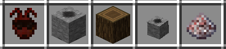

## Anthill Inside

A [Minecraft](https://minecraft.net) (Java Edition) mod adding Red Ants, which provides a little
bit of "natural automation" for vanilla dominated or non-tech packs. Additions of blocks, items,
and recipes are reduced to a minimum, the Look & Feel is designed vanilla-like.

***Note for coders/modders: Please take a look into the MC version branches to view/clone the source code.***

### Distribution file download

Main distribution channel for this mod is CurseForge:

  - Release/beta versions: https://www.curseforge.com/minecraft/mc-mods/anthillinside/files
  - All versions: https://minecraft.curseforge.com/projects/anthillinside/files

### Description

The mod adds basically three things to the game:

  - Red Ant Hive: Breeding and processing block.
  - Red Ants: Workers in Hives, or placed as Ant Trail for item transport.
  - Red Sugar: Hive colony growth and work accelerator.

It is suitable to get a "wee bit" of automation in vanilla dominated packs (or "natural"
packs without any industrial tech mod), but also to introduce newcomers into a small facet
of what contemporary tech mods offer.

Red Ant Hives look Cobblestone-like and can be found when mining Redstone Ore. These colonies
allow you to automate some simple tasks, such as 3x3 crafting, cooking and smelting,
composting, or item transfer (collection, Minecart loading/unloading). What and how shall be
processed can be defined by placing corresponding items into special slots in the GUI:

There is no "Manual" for the mod, however, the GUI provides extensive explanations with tool
tips when hovering slots and images, as well as a help tool tip when hovering the items with
the Control+Shift keys down.

A brief excerpt of the Hive here:

  - The three top-middle slots is where the ant colony resides and grows. The more ants, the
    faster things progress.

  - The complete left slot side is for "input". This is where inserted items, or also collected
    items, go into. The top-left Hopper slot allows to collect items from the adjacent inventories
    (also Minecarts etc) or items in front of the nest input hole.

  - The complete right side is the output side, from which items can be manually taken, or
    automatically exported by putting a Hopper, Dropper, or Dispenser into the bottom-right
    Hopper slot: Placing a Hopper there inserts into adjacent inventories or Minecarts. Putting
    a Dropper into this slot "gently" drops the items in front of the output hole of the hive,
    and a Dispenser throws them out (with bad aim).

  - The slot in the center defines which work the ants shall do. Place a Crafting Table in it
    for 3x3 crafting, a Furnace/Blast Furnace/Smoker for smelting, a Composter for ... composting,
    or a Hopper for just passing items from left to right. *Note for Furni: The 3x3 slots can be
    used to tell which fuels are allowed.*

  - With a Redstone signal the hive can be instructed not to eject items from the output slots.

The Red Ant Trail is simply a water stream like item transport system, except that item insertion
into inventories is supported, upward trails are possible, and items can be stopped or diverted to
adjacent Ant Trails with a Redstone signal.

Finally, Red Sugar is a mix of Redstone dust and Sugar. Putting it into ant nets makes them work
and breed faster, but only for a short time.

### Screenshots

### Answers

- Backports? None planned or intended (sorry in advance).

- Where does the mod name come from? Read Terry Pratchett.

- Lore? No. If we had to make one up, I'd probably phrase it like "Red Ants are living fossils,
  born of Redstone, Fire, and Steel, made by the mighty god Cinnabar himself, when the server
  world was young, crashing, and covered glowing red, with particles of course, enduring the dark
  ages, until they are found in the remains of creation, and put to unmeaningful work. [...]".
